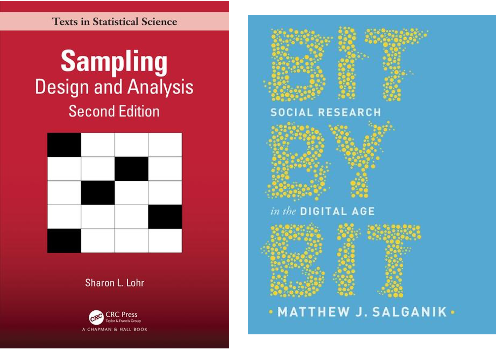

# Sampling: Essentials of sampling, asking, and observing

```code
$ echo "Data Science Institute"
```
---

# Learning Outcomes

*What makes a good sample, survey, and study? How does sampling theory differ from sampling in practice?*

- Identify characteristics of a good sample, and sampling approaches that will produce these characteristics.
- Identify characteristics of good survey and questionnaire design.

---

# Key Texts

- Lohr, 2019, *Sampling Design and Analysis* , 2nd Edition, CRC Press, **Chapter 1**
- Salganik, 2018, Bit by Bit: Social research in the Digital Age, **Chapter 3**



<!-- 
Image sources: *[Sharon Lohr](https://www.sharonlohr.com/sampling-design-and-analysis-2e,)* , *[Princeton University Press](https://press.princeton.edu/books/paperback/9780691196107/bit-by-bit)* -->

---

# Requirements of a Good Sample

---

# Requirements of a Good Sample

- Ideally the sampled population would be the same as the target population, however this is rarely the case
- In a **representative sample**, the characteristics of the sampled population match the characteristics of the target population
- Representation issues can arise at all stages of the study design and sampling process

---

# Requirements of a Good Sample


<!-- Note: this figure was included in Section 5.2 slides as well, but has now been coloured to represent different groups of individuals -->

---


- We want the characteristics of the sample (green) to match the characteristics of the target population (yellow).
- For this to be true, all of the following need to match the characteristics of the target population (yellow) as well:
    - Individuals in the sampling frame (green)
    - Individuals excluded from the sampling frame (yellow)
    - Non-respondents (pink)
- Individuals not eligible for the survey (grey) must be well defined, distinct from the target population, and properly excluded from analysis

---

# Probability Sampling

---

# Probability Sampling In Theory

- Individuals have a chance of of being sampled
- The probability of being sampled is known for each individual
- All sampled individuals respond to the survey, or non-response is random
- Analysis is straightforward
- Estimates are accurate and precise

---

# Probability Sampling in Practice

- Some non-response is inevitable
- Non-response is often biased
- Non-response rates are increasing overall
- Results depend on methods that researchers use to adjust for non response

---

# Non-Probability Sampling

- Benefits
    - Improved response rates
    - Faster
    - Cheaper
- Drawbacks
    - Sampling unit selection probabilities are unknown, and not guaranteed to be non-zero
    - More difficult to produce accurate estimates for the target population

---

# Questionnaire Design

---

# Questionnaire Design

- Section 1.5, Lohr, 2019
    - Always test your questions
    - Keep it simple and clear
    - Use specific questions instead of general ones, if possible
    - Relate your questions to the concept of interest

<!-- Slides intentionally left sparse; elaborate from notes in Lohr (2019) Section 1.5
-->

---

# Questionnaire Design

- Decide whether to use open or closed questions
- Report the actual question asked
- Avoid questions that prompt or motivate the respondent to say what you would like to hear
- Consider the social desirability of responses to questions, and write questions that elicit honest responses

<!--
Slides intentionally left sparse; elaborate from notes in Lohr (2019) Section 1.5
-->

---

# Questionnaire Design

- Avoid double negatives
- Use forced-choice, rather than agree/disagree questions
- Ask only one concept per question
- Pay attention to question order effects

<!--
Slides intentionally left sparse; elaborate from notes in Lohr (2019) Section 1.5
-->

---

# Types of Questions

- **Open questions** allow respondents to choose the format and content of their own response.
- **Closed questions** have respondents choose from a predetermined group of responses (i.e. multiple choice, “Select all that apply”)
- **Leading questions** prompt respondents into choosing or stating a specific (desired) response
- **Double-barreled questions** contain more than one subject that may elicit conflicting opinions from a respondent

---

# Observational Studies

---

# Asking versus Observing

- Surveys and observational studies have different strengths
- Observational data has certain advantages over surveys:
    - High “response rate”
    - Observations do not depend on interpretations of questions or potentially flawed self-reported measurements
    - Data sets are often large

---

# Asking versus Observing

- Surveying is useful even in the presence of large observational data sources
    - Many observational data sources contain inaccuracies or are incomplete
    - Key qualitative traits like emotions, opinions, or knowledge are difficult to assess through observational studies
    - Surveying and observational data can often be complementary and provide great insight when used together

---

# Surveys Linked to Observation Data Sources

- **Enriched asking**: big data set is missing certain measurements, which are then collected by surveying and linked to the original data
    - Record linkage can be difficult
    - Quality of original data source may be difficult to assess
- **Amplified asking**: researcher trains a prediction model using survey data collected from a small number of respondents plus their corresponding records from a big data set, then uses the model to predict responses to survey questions for all individual records in the original data set
    - Faster and cheaper than large-scale surveys
    - However, currently lacks strong theoretical basis

---

# Next

Errors
