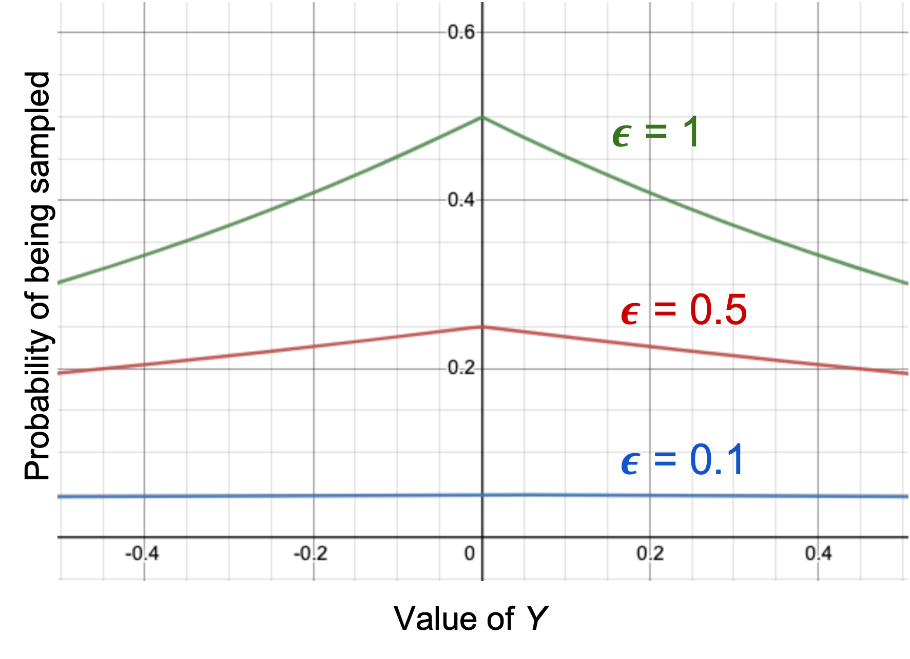
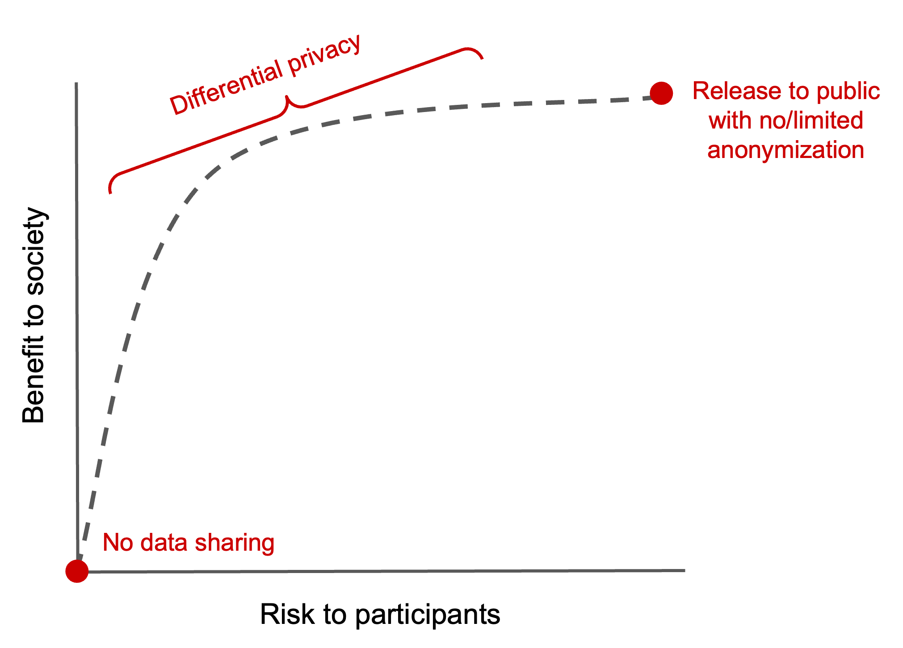

# Sampling: Differential Privacy

```code
$ echo "Data Science Institute"
```
---

# Key Texts

- Salganik, M. (2019). Understanding and managing informational risk. In *Bit by bit: Social research in the Digital age* (pp. 307–314). Chapter, Princeton University Press. 
- Wood, A., Altman, M., Bembenek, A., Bun, M., Gaboardi, M., Honaker, J., Nissim, K., OBrien, D.R., Steinke, T., & Vadhan, S. (2018). *[Differential privacy: A primer for a non-technical audience](https://salil.seas.harvard.edu/publications/differential-privacy-primer-non-technical-audience)* . *Vanderbilt Journal of Entertainment & Technology Law, * 21(1) 209-275.

---

# Background

---

# Informational Risk and Anonymization

- **Informational risk** refers to the potential for harm to occur from the disclosure and sharing of data
- **Anonymization** refers to the process of removing **personally identifying information (PII)** from a data set in hopes of keeping the data anonymous upon release to a broader audience (other researchers, the general public, etc.)
- ⚠️**Anonymization is often not entirely effective at keeping data anonymous**⚠️

---

# Case Study: Massachusetts Group Insurance Company

- The GIC is a government agency responsible for purchasing insurance and managing health records for Massachusetts state employees. They released an “anonymized” data set of health records that excluded names and addresses but included zip code, birthdate, sex, and medical information.
- Latanya Sweeney obtained this data set and a copy of voting records for the city of Cambridge, MA, which included name, zip code, birthday, and sex. By linking records between the two data sets, Sweeney was able to find extract then governor William Weld’s medical records.

---

# Exercise: Could someone file a lawsuit again the government agency citing potential harms as a result of personal information uncovered in the data linkage?

---

# Case Study: The Netflix Prize

- In 2006, Netflix released a data set of 100 million movie ratings from almost 500,000 users as part of a contest to improve its movie recommendation algorithm. The data had PII removed and slight perturbations introduced in some ratings. Similar to the GIC example, researchers Arvind Narayanan and Vitaly Shmatikov combined the Netflix data with user data from IMDb to identify individuals who left particular movie ratings in the Netflix data.
- This re-identification process resulted in a lawsuit filed against Netflix citing potential harms as a result of personal information uncovered in the data linkage. Movie ratings and reviews from the data sets had potential to expose users sexuality, political views, experience with mental illness and substance abuse, and more.

<!--
Additional information on lawsuit: https://www.wired.com/2009/12/netflix-privacy-lawsuit/
-->

---

# Differential Privacy

---

# Introduction to Differential Privacy by Simply Explained


[📼 the video](http://www.youtube.com/watch?v=gI0wk1CXlsQ)

---

# Differential Privacy

> ⚠️ The goal of **differential privacy** is to analyze and share information about a data set without revealing information about any given individual within the data set ⚠️ 
- Differential privacy techniques add **random noise** to computations on the data set
- Randomness obscures any one individual’s contribution to the data set
- Randomness means that all output is **approximate**
- Generally used for **aggregate statistics** and **modelling** – counts, proportions, averages, linear regression, machine learning algorithms

---

Based on Nissim et al., Figure 2


---

# “Opt-out” Scenarios

- Suppose John is invited to participate in a study about the relationship between socioeconomic factors and medical outcomes in the US. Participants are asked to complete a questionnaire covering topics related to their finances and medical history. John is concerned that information he provides, such as his HIV status, may be used against him if de-identified data is released and accessed by his insurance company. However, he recognizes that participating in the study would benefit the researchers and perhaps generate important results.

---

# “Opt-out” Scenarios

- John’s **opt-out scenario** refers to the case where John decides not to participate and the analysis is conducted without his health or financial data
- Differential privacy ensures that:
  - Results of the study will stay approximately the same regardless of whether or not John participates
  - Output of the analysis will not disclose any information that is specific to John
- Thus, John faces minimal additional informational risk by participating in the study

---

# Privacy Loss Parameter

---

# Privacy Loss Parameter

- Estimates from a data set should remain approximately the same regardless of any one individuals’ data being included or excluded
- Differential privacy allows a slight difference between actual analysis and any individual opt-out scenario
- Privacy loss parameter, **$\epsilon$** , represents the **additional informational risk** that any individual would face **beyond the risk incurred in the opt-out scenario**

> $0 ≤ \epsilon ≤ 1$
> Low $\epsilon$ = Low accuracy, stronger privacy protection
> High $\epsilon$ = High accuracy, weaker privacy protection

---

Based on Nissim et al., Figure 3


---

From Nissim et al., pp. 12

- John is concerned that a potential health insurance provider will deny him coverage in the future, if it learns certain information about his health, such as his HIV positive status, from a medical research database that health insurance providers can access via a differentially private mechanism.
- If John believes his probability of being denied insurance coverage is at most 5% (due to various outside factors) if his information is not included in the medical research database, then adding his information to the database can increase this probability to, at most,

  > $$5\% \cdot(1 + \epsilon) = 5\% \cdot 1.01 = 5.05\%.$$

- Hence, the privacy loss parameter ($\epsilon$ = 0.01, in this example) ensures that the probability that John is denied insurance coverage is almost the same, whether or not information about him appears in this medical research database.

<!-- 
Ask students to consider how this would be different if \epsilon = 0.1.
-->

---

# Implementation

---

# Overview

Differential privacy adds uncertainty to data in the form of **random noise**
> - Suppose you are looking to measure the fraction ***p*** of some trait in a population. You have a sample of size ***n*** , and within this sample there are *m* individuals with the trait.
> - Without differential privacy, ***p = m/n***.
> - *With* differential privacy, random noise ***Y*** is added to the computation to hide the contribution of a single individual.
> - Instead of ***m*** , we have ***m’ = m + Y*** .
> - Instead of ***p = m/n*** , we have ***p’ = m’/n = (m + Y)/n***.

---

# Random Noise

- Magnitude of the random noise *Y* depends on $\epsilon$
- $\epsilon$ and *Y* are **inversely proportional** – smaller $\epsilon$ = larger *Y* = more noise
- The relationship between the true and measured values of m can be described as,

  > $$ |m'-m|\approx\frac{1}{\epsilon} $$

- *Y* is often sampled from the **Laplace distribution** with mean 0 and standard deviation $\sqrt{2}/\epsilon$
  - Denoted Laplace (0, 1/$\epsilon$)

---

# Laplace Distribution

- Distribution is **symmetric** – differential privacy estimates are equally likely to be higher or lower than the true value
- When **$\epsilon$** = 1, there is a ~63% chance that $-1≤Y≤1$
  - *m’* will likely be very close to *m*
  - High accuracy, low privacy
- When **$\epsilon$** = 0.1, there is a ~10% chance that $-1≤Y≤1$
  - *m’* will likely **not** be very close to *m*
  - Low accuracy, high privacy



---

# Practical Considerations

---

# Practical Considerations

- Accuracy
  - Large sample sizes/data sets are required for accurate estimates
- Informational risk
  - Combining differentially private data sets or conducting multiple queries on the same differentially private data set increases informational risk
  - Total informational risk is bounded by the sum of the informational risk of any individual data set
    - For a combination of *n* differentially private data sets, $\epsilon_T = \epsilon_1 + \epsilon_2 + … + \epsilon_n$
  - Different types of analyses will require different balances of informational risk and accuracy

---

# Ethical Considerations

---

# Ethical Considerations

- Data sensitivity
  - Sensitivity is subjective
  - Assume that all data is *potentially* identifiable and *potentially* sensitive
  - Privacy concerns apply to all data sets to some degree
- Data sharing
  - Data sharing increases informational risk
  - Access to data provides great benefit to other researchers and the general public
  - Do not ignore the potential benefits of data sharing

---

Based on Salganik (2018), Figure 6.6


---

# Next
Cluster Sampling
