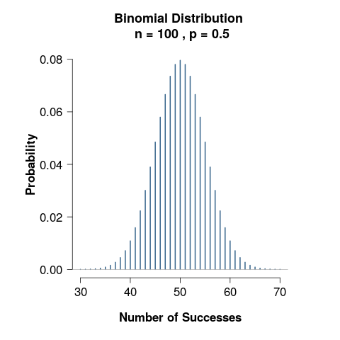
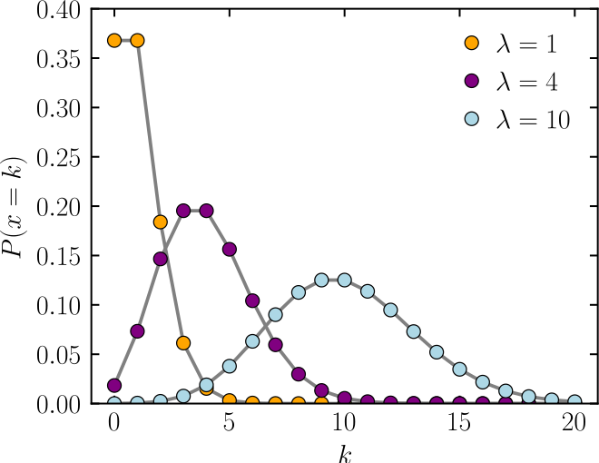
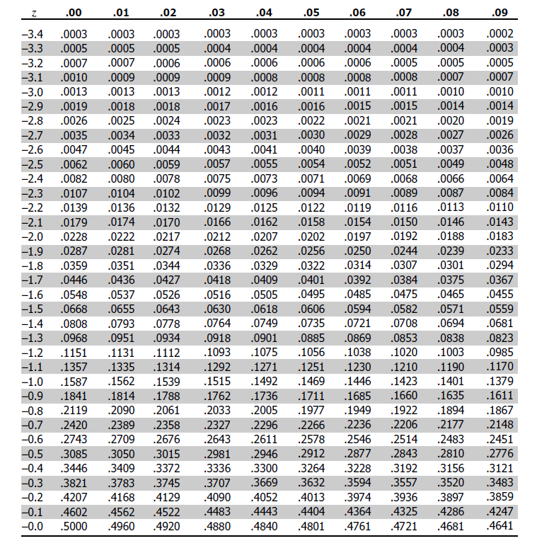
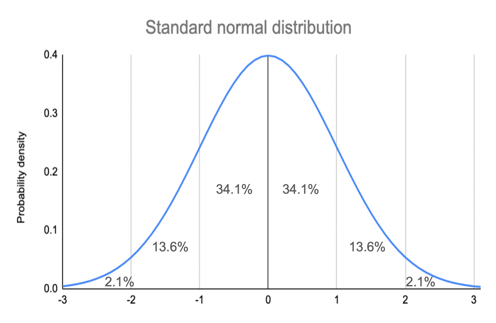
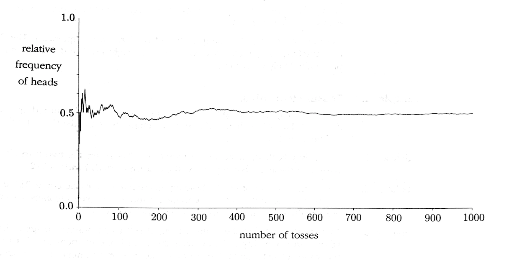

# Sampling: Probability 101

```code
$ echo "Data Science Institute"
```
---

# Learning Goals

- Introduce essential probability concepts
- Discuss statistical distributions (and why they matter!)
- Use examples to build statistical intuition

*How do we calculate and interpret probabilities? What is a statistical distribution?*

---

# Key Texts


- Pitman, 1993, *Probability* , Springer, Chapters 1-3
- Image source: *[Springer](https://link.springer.com/book/10.1007/978-1-4612-4374-8)*

---

# Before we start...

---

# Intro to Probability

---

# Definitions

- An **outcome space** is a set of all possible outcomes of some kind, often represented by $\Omega$.
    - For example, $\Omega$ = {A, B, C,..., Z} is an outcome space containing all letters of the alphabet
- An **event** is a subset of an outcome space.
    - There are often many possible events for a specific outcome space
    - Possible events for $\Omega$ above could be vowels {A, E, I, O, U} or letters before E {A, B, C, D}
- A **probability** is a function of an event describing how likely it is to occur

---

# Equally Likely Outcomes

- If all outcomes in a set $\Omega$ are equally likely, the probability of event *A* is the number of outcomes in *A* divided by the total number of outcomes,

    > $$P(A)=\frac{\#A}{\#\Omega}$$

- $P(A)$ can be read as “the probability of A”.

---

# Example: Rolling a die

- For a six-sided die, the outcome space is,

    > $\Omega = \{1, 2, 3, 4, 5, 6\}$

- Some possible events and their probabilities are,

|          Description           |        Event        |  Probability  |
| :----------------------------: | :-----------------: | :-----------: |
|    An even number is rolled    |    A = {2, 4, 6}    | 3/6 = ½ = 0.5 |
| A number less than 6 is rolled | B = {1, 2, 3, 4, 5} |  ⅚ = 0.833…   |
|         A 6 is rolled          |       C = {6}       |  ⅙ = 0.166…   |

---

# Sets and Events

<!-- - Pitman (1993), Table 1

|         Event language         |      Set language       | Set notation  | Venn diagram |
| :----------------------------: | :---------------------: | :-----------: | :----------: |
|         Outcome space          |      Universal set      |      $\Omega$       |              |
|             Event              |      Subset of $\Omega$       | A, B, C, etc. |              |
|        Impossible event        |        Empty set        |       ∅       |              |
|  Not A, or the opposite of A   |     Complement of A     |      AC       |              |
|     Either A or B or both      |    Union of A and B     |     A \cup B     |              |
|          Both A and B          | Intersection of A and B |     A ∩ B     |              |
| A and B are mutually exclusive |  A and B are disjoint   |   A ∩ B = ∅   |              |
|          If A, then B          |   A is a subset of B    |     A ⊆ B     |              | -->


---

# Partitions

- An event B is **partitioned** into n events *$B_1, B_2, ..., B_n$* if

1. *$B = B_1 \cup B_2 \cup … \cup B_n$* – every outcome in *B* belongs to some event $B_i$ , none are left out

2. *$B_1, B_2, ..., B_n$* are **mutually exclusive** – if an outcome is in event *$B_i$* , it is not in any other event


---

# Rules of Probability

- For an event *B* over an outcome space $\Omega$,
- **Non-negativity**: *$P(B) ≥ 0$*
- **Addition**: If *$B_1, B_2, ..., B_n$* is a partition of *B* , then

    > *$P(B)=P(B_1)+P(B_2)+…+P(B_n)$*

- **Total one**: $P(\Omega) = 1$

---

# Example: Drawing cards

- Suppose you have a regular deck of cards. Let *B* represent the event “drawing a heart”. Let *$B_1$* and *$B_2$* be a partition of *B* , with *$B_1$* = “drawing non-numeric heart card (J, Q, K, A)” and *$B_2$* = “drawing a numeric heart card (2,…,10)”

- *$B_1$* and *$B_2$* is a valid partition, since all heart cards are either numeric or non numeric, and a card cannot be both a numeric card and a non-numeric card (mutual exclusivity)

    > $$P(B) = 13/52 = 1/4 ≥ 0$$
    > $$P(B1) + P(B2) = 4/52 + 9/52 = 13/52 = 1/4 = P(B)$$
    > $$P(\Omega) = P(\text{“draw any card in the deck”}) = 1$$
---

# Conditional Probability

---

# Conditional Probability

- ⚠️ **Conditional probability** can be described as the probability that event *A* will happen **given that event *B* has already happened** ⚠️
- The notation for conditional probability is $P(A|B)$
- The formula for conditional probability is,
    > $$P(A|B) = \frac{P(A\cap B)}{P(B)}$$
- As long as $P(B) ≠ 0$

---

# Example: Rolling a die

- Suppose you roll a regular die, but haven’t yet looked at the result. Let event A be “rolling a 4”, and let event B be “rolling an even number”.
- The probability that number you rolled is a 4 is,
    > $$P(A)=\frac{1}{6}$$
- Now suppose I look at the die and tell you that the number you rolled is **even** . Given this new information, the probability that the number you rolled is a 4 is,
    > $$P(A|B) = \frac{P(A\cap B)}{P(B)}=\frac{P(\text{"rolling a 4" and "rolling an even number"})}{P(\text{"rolling an even number"})}=\frac{\frac{1}{6}}{\frac{1}{2}}=\frac{1}{3}$$

---

# Independence

- If events A and B are **independent** , event A is not affected by the occurrence of event B.
- This can be described mathematically as,
    > $$P(A|B)=P(A)$$
- From the formula for conditional probability, we can then derive the following formula for independent events,
    > $$P(A\cap B)=P(A)P(B)$$
- The same applies for any number of disjoint events.

---

# Random Variables

---

# Random Variables

- **Random variables** are a way to describe a set of possible outcomes with a distribution of probabilities over the set of outcomes.
- Usually denoted with capital letters: *X, Y, Z* , etc.
- Random variables are similar to events
    - Events are a specific outcome or set of outcomes, while random variables describe possible outcomes and their various probabilities
    - An event “Number on the die is a five” or {5} or *X* = 5 is one possible outcome of the random variable *X* , “the number obtained by rolling a die”

---

# Random Variables

- The **range** of a random variable is all of the values it could possibly take. This can be continuous (0 ≤ *X* ≤ 10) or discrete (X $\in$ {1, 2, 3}).
- The distribution of random variable is determined by the probabilities of values within its range,

    > $$P(X=x)\text{ for x }\in\text{ range of }X$$

---

# Example: Rolling two dice

- Let *X* represent the sum of the faces showing on two rolled dice.

<style scoped>
table {
  font-size: 20px;
  table-layout:fixed;
  width:100%;
}
</style>

|         x         |  2   |    3     |       4       |         5          |            6            |              7               |            8            |         9          |      10       |    11    |  12  |
| :---------------: | :--: | :------: | :-----------: | :----------------: | :---------------------: | :--------------------------: | :---------------------: | :----------------: | :-----------: | :------: | :--: |
| Possible outcomes | 1+1  | 1+2, 2+1 | 1+3, 2+2, 3+1 | 1+4, 2+3, 3+2, 4+1 | 1+5, 2+4, 3+3, 4+2, 5+1 | 1+6, 2+5, 3+4, 4+3, 5+2, 6+1 | 2+6, 3+5, 4+4, 5+3, 6+2 | 3+6, 4+5, 5+4, 6+3 | 4+6, 5+5, 6+4 | 5+6, 6+5 | 6+6  |
|     P(X = x)      | 1/36 |   1/18   |     1/12      |        1/9         |          5/36           |             1/6              |          5/36           |        1/9         |     1/12      |   1/18   | 1/36 |

---

# Indicator Variables

- **Indicator variables** , denoted $I_A$, are a specific type of random variable that take the value 0 or 1 to indicate the occurrence of a given event *A* .
- Some examples of indicator variables may be votes in a two-party election (with event *A* being a vote for a particular candidate), votes for or against a bill, satisfied versus not satisfied reviews for a product, etc.

---

# Distributions

---

# Distributions

- ⚠️ A **probability distribution** is a statistical function that describes the probabilities of all possible events in an outcome space. ⚠️
- Distributions can be **discrete** (if the outcome space is distinct events, like rolling a die) or **continuous** (if the outcome space is a range of values, like choosing any real number between 1 and 10).
- Some features of interest for distributions may be their mean, variance, mode, skew, etc.

---

# Binomial Distribution

- The **binomial distribution** concerns sequences of events with two possible outcomes: **success** and **failure**.
- Success occurs with probability ***p*** , and failure occurs with probability ***q = 1 - p***. Trials defined this way are called **Bernoulli trials** .
- ⚠️ The binomial distribution helps determine the probability of getting ***k* successes in *n* independent trials (with replacement)** ⚠️

---

# Binomial Distribution Formula

- For *n* independent trials with probability *p* of success and probability *q* = 1 - *p* of failure, the probability of ***k* success in *n* independent trials** (with replacement) is,

    > $$P( \text{k success in n trials} ) = \binom{n}{k}p^{k}q^{n-k}$$

- $\binom{n}{k}$is called “ *n* choose *k* ” and describes the number of possible combinations of *k* successes and *n - k* failures:

    > $$\binom{n}{k}=\frac{n!}{k!(n-k)!}$$

---

# Binomial Distribution



- For a large number of trials *n* , we expect the number of successes to be about *np* .
- For n = 100 and p = 0.5, the distribution of number of successes is centered around 50 (the most likely) and the total number of successes gets less likely as the numbers get farther from 50.

---

# Example: Drawing cards

- Suppose you draw *n* = 5 cards from a standard deck, and your desired outcome is drawing a club. Then *p* = 13/52 = ¼ and *q* = 1 - *p* = 1 - ¼ = ¾.
- For *k* = 1 success, the possible combinations of cards drawn are:

    > {➡️♣⬅️,2,3,4,5},
    > {1,➡️♣⬅️,3,4,5},
    > {1,2,➡️♣⬅️,4,5},
    > {1,2,3,➡️♣⬅️,5},
    > {1,2,3,4,➡️♣⬅️}

- Mathematically this can be represented as,
    > $$\binom{5}{1}=\frac{5!}{1!(5-1)!}=\frac{5\cdot4\cdot3\cdot2\cdot1}{1(4\cdot3\cdot2\cdot1)}=5$$

<!-- NOTE: As an exercise, go through 5 choose 2 and the logic behind the equation. -->
---

# Example: Drawing cards

- Since the trials are independent, the probability of getting 1 success in 5 trials is the product of the probability of getting a club on one trial and the probability of getting non-clubs on four trials.

    > $$P(\text{Club})P(\text{Non-club})P(\text{Non-club})P(\text{Non-club})P(\text{Non-club})=\frac{1}{4}\cdot\frac{3}{4}\cdot\frac{3}{4}\cdot\frac{3}{4}\cdot\frac{3}{4}=\frac{1^1}{4}\cdot\frac{3^4}{4}=0.0791$$

- Putting the two calculations together, we have,

    > $$P(\text{1 club in 5 draws})=\binom{5}{1}\frac{1^1}{4}\cdot\frac{3^4}{4}=5\cdot0.0791=0.396$$

---

# Uniform Distribution

- The **uniform distribution** describes a situation in which every outcome on a certain set or interval is **equally likely** .
- This can be represented mathematically as,

    > $$P(X=x)= 
    \begin{cases} 
    \frac{1}{|\Omega|} & \text{if } x \in \Omega, \\
    0 & \text{otherwise}
    \end{cases}$$
    or
    > $$P(X=x)= 
    \begin{cases} 
    \frac{1}{b-a} & \text{if } a \leq x \leq b, \\
    0 & \text{otherwise}
    \end{cases}$$

---

# Uniform Distribution

- Examples
    - Rolling a die
    - Drawing any card from a normal deck
    - Choosing a random number between 1 and 100
    - Choosing a random student in a classroom

<!-- Image retrieved from https://commons.wikimedia.org/wiki/File:Uniform*Distribution*PDF_SVG.svg -->


---

# Poisson Distribution

- The **Poisson distribution** is an approximation of the distribution of the **number *N* of occurrences of events of some kind**, when the events all have small probabilities and are independent.

    > $$P(N=k)\approx\frac{e^{-\mu}\mu^k}{k!}\text{ for k = 1, 2, ...}$$

- The Poisson distribution is a discrete probability distribution.

---

# Poisson Distribution

- Examples
    - Number of wins in n games of roulette for a gambler who bets on a single number each game
    - Number of rain drops that land on a particular area of a roof during a set time interval
    - Number of people who enter a store in a certain time interval



<!-- Image retrieved from https://commons.wikimedia.org/wiki/File:Poisson_pmf.svg -->

---

# Normal Distribution

- The **normal distribution** is one of the most common and important distributions
- It is represented by the equation,

    > $$P(X=x)=\frac{1}{\sqrt{2\pi\sigma}}e^{-\frac{(x-\mu)^2}{2\sigma^2}}$$

- where $\mu$ is the mean of X and $\sigma$ is the standard deviation.
- A random variable X following a normal distribution is often denoted,

    > $$X \sim \mathcal{N}(\mu, \sigma^2)$$

---

# Normal Distribution

- The normal distribution is centered and symmetric about $\mu$. $\sigma$ describes the horizontal spread (how wide the distribution is).
- The normal distribution can be used to be use to approximate other distributions for easy calculations of probabilities


---

# Standard Normal Distribution

- The standard normal distribution is a normal distribution with mean 0 and standard deviation 1.
- In general, a random variable *X* with a normal distribution can be standardized using the following formula,

    > $$Z = \frac{X-\mu}{\sigma}$$


<!-- Image retrieved from https://www.scribbr.com/statistics/standard-normal-distribution/ -->

---

# Example: Z-Scores

- Z-Scores represent the probability that a value is less than or equal to the value of a given standardized random variable.



<!-- Image retrieved from http://www.z-table.com/ -->

---

# Expected Value

---

# Expected Value

- The **expected value** or **expectation** of a random variable *X* is the mean of the distribution of *X* , denoted E( *X* ) or $\mu$. This is represented mathematically as,

    > $$E(X) = \sum_{\text{Every x}} xP(X=x)$$

- The expected value is the average of all possible values of *X* weighted by their probabilities.
- The expected value of indicator variable $I_A$ is the probability of event A,

    > $$E(I_A)=P(A)$$

---

# Example: Sampling a student

- Suppose you are randomly sampling a student from a school. There are 200 students each of ages 16, 17, and 18. Let random variable *X* represent the age of the student sampled.
- The expected age of the student selected is,

    > $$E(X)=\sum_{\text{Every x}}xP(X=x)=16(\frac{200}{600})+17(\frac{200}{600})+18(\frac{200}{600})=17$$

- Now suppose there are 100 students age 16, 200 students age 17, and 300 students age 18. The new expected age is,

    > $$E(X)=\sum_{\text{Every x}}xP(X=x)=16(\frac{100}{600})+17(\frac{200}{600})+18(\frac{300}{600})=17.333$$

---

# Properties of Expectation

- Constants : The expectation of a constant random variable is its constant value

    > $$E(c)=c$$

- Scalar multiplication : For random variable X multiplied by constant c,

    > $$E(cX) = cE(X)$$

- Addition : The expectation of a sum of random variables is the sum of the expectations

    > $$E(X+Y) = E(X) + E(Y)$$

---

# Variance and Standard Deviation

---

# Variance and Standard Deviation

- The **variance** of X, denoted Var(X), is the mean squared deviation of X from its expected value E(X),

    > $$Var(x)=E([X-E(X)]^2)=E(X^2)-[E(X)]^2$$

- The **standard deviation** of X, denoted SD(X), is the square root of the variance of X:

    > $$SD(X)=\sqrt{Var(X)}$$

<!-- TODO: Walk through a simple proof deriving the computational formula for variance from the usual formula -->

---

# Variance Properties

- **Addition**: for independent random variables $X_1$, $X_2$,..., $X_n$, the variance of their sum is,

    > $$Var(X_1+...+X_n)=Var(X_1)+...+Var(X_n)$$

- **Scalar multiplication**: for random variable X and scalar c,

    > $$Var(cX) = c^2Var(X)$$

<!-- TODO: Easy derivation from the definition for variance -->

---

# Variance and Standard Deviation

- Variance is often denoted $\sigma^2$, with SD denoted $\sigma$
- Variance and SD describe how spread out the distribution of a variable is
- SD is often easier to interpret since its units are the same as the mean

- **⚠️ In general ⚠️** 
    - For a random variable *X* with some distribution, you should expect the value of *X* to be around the expected value E( *X* ), plus or minus a few times the standard deviation SD( *X* )

---

# Example: Normal Distribution

- On a normal distribution, ~68% of the probability density lies within one SD of the mean:

    > $$P(\mu-\sigma\leq X\leq\mu+\sigma) \approx 0.68$$

- For the standard normal *N(0, 1)* , this means *X* is fairly likely to be between -1 and 1, and that 2.5 would be a very unlikely value of *X.*




<!-- Image retrieved from https://www.scribbr.com/statistics/standard-normal-distribution/ -->

---

# Law of Large Numbers

---

# Law of Large Numbers


<!-- Pitman (1993), Figure 2 -->

---

# Law of Large Numbers

- ⚠️ If the number of trials *n* is large, the proportion of successes in *n* independent trials will, with overwhelming probability, be very close to *p* , the probability of success on each trial ⚠️
- **Intuition for sampling:**
    - As the number of units sampled increases, the proportion of units that exhibits a certain trait will grow closer and closer to the true proportion of individuals in the population with that trait

---

# Central Limit Theorem

---

# Central Limit Theorem

- ⚠️ Let $S_n$ = $X_1$ + $X_2$ + … + $X_n$ be the sum of $n$ independent random variables each with the same distribution. For large $n$, the distribution of $S_n$ is approximately normal, with mean E( $S_n$ ) = $n\mu$ and variance Var( $S_n$ ) = $\sigma{^2}{_n}$, where $\mu$ = E( $X_i$ ) and $\sigma^2$   = Var( $X_i$ ).⚠️ 
- This also holds true for,
    > $$\bar{X}_n=\frac{S_n}{n}\text{, with }E(\bar{X}_n)=\mu\text{ and }Var(\bar{X}_n)=\frac{\sigma^2}{n}$$

    > $$\bar{X}_n \sim \mathcal{N}(\mu, \frac{\sigma^2}{n})$$

<!-- Note: Open R file “5.1-Probability-CLT Demo.R” and work through the demo -->

---

# Who cares?

- Sample size and quantity affect how well our conclusions can represent our target population (LLN, CLT)
- Distributions and their assumptions affect our models and the ways that we calculate various statistics


<!-- Note: Open R file “5.1-Probability-CLT Demo.R” and work through the demo -->

---

# Next

- Probability vs Non-probability sampling
- Sampling Types and Sample Design
- Observational Studies and Censuses 

