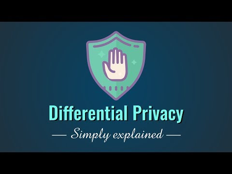
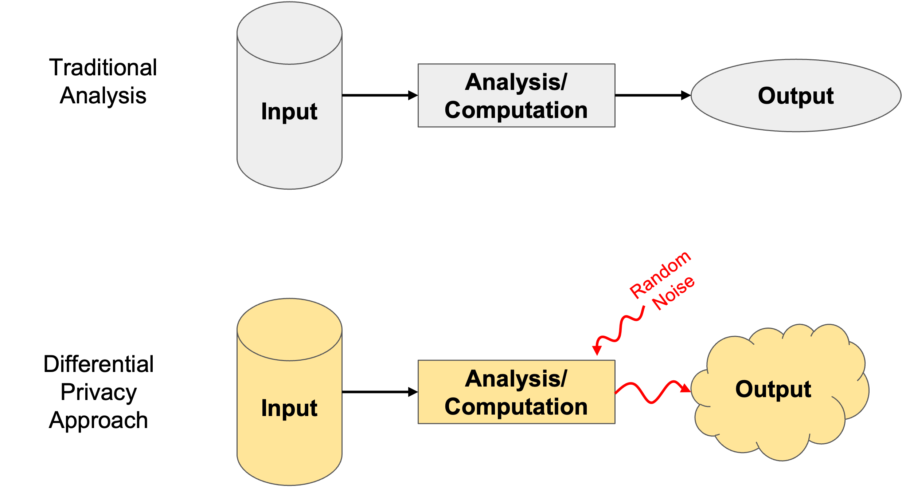

# Sampling: Privacy

```code
$ echo "Data Science Institute"
```
---

# Key Texts

- Salganik, M. (2019). Understanding and managing informational risk. In *Bit by bit: Social research in the Digital age* (pp. 307–314). Chapter, Princeton University Press. 
- Wood, A., Altman, M., Bembenek, A., Bun, M., Gaboardi, M., Honaker, J., Nissim, K., OBrien, D.R., Steinke, T., & Vadhan, S. (2018). *[Differential privacy: A primer for a non-technical audience](https://salil.seas.harvard.edu/publications/differential-privacy-primer-non-technical-audience)* . *Vanderbilt Journal of Entertainment & Technology Law, * 21(1) 209-275.

---

# Privacy and Confidentiality

---

# Key Terminology

- **Data privacy** = the ability to control when and where your personal data are shared
- **Informational Risk** = potential for harm resulting from the disclosure and sharing of data
- **Personally identifying information (PII)** = includes name, address, telephone number, age, gender, personal opinions or views 

---

# Key Terminology

- **Anonymization** = process of removing PII from a dataset 
- **Confidentiality** = granted to respondents; only the researcher knows the identities of respondents 
	- E.g. I interview Sam, I know Sam is Sam, but in my paper, I refer to Sam only as ‘Participant A’ or by a pseudonym
- **Anonymity** = granted to respondents; identities of individual respondents not known to researcher
	- E.g. I create a survey, Sam fills out the survey anonymously online, I never know that Sam is the one who filled out the survey

---

# Confidentiality Considerations

- Data collection medium 
	- In person – who might see the participants walking into the lab or interview location?
	- Digital – Is third party software safe? 
- Data storage
	- Password protected computer? Double-locked office and filing cabinet? Portable hard drive?
	- Cloud – Institutional OneDrive? 
- Who has access to the data?
	- Think about: shared offices, IT or other colleagues
	- Have to balance need for backups with reduced risk

---

# Confidentiality Considerations

- Retention and disposal schedule 
	- How long will you keep data for? Why? Balance storage resources vs data needs
	- How will you dispose of data when retention period is done? (Shredding hard copies? Deleting digital files?)
- Clarify limits on confidentiality
	- What if someone discloses something illegal? 
	- Statements like ‘confidentiality is not absolute, a disclosure of personal information may occur if required by law’
- If no confidentiality - why?
	- E.g. Respondents are key informants in their fields (world leaders, expert academics in niche areas)

---

# Explore 'Real World' Resources

Academic 
- U of T offers research support to ensure data security and confidentiality
- https://research.utoronto.ca/data-security-standards-personally-identifiable-other-confidential-data-research 

Public Sector
- A privacy checklist!
- https://www.ipc.on.ca/wp-content/uploads/2015/04/best-practices-for-protecting-individual-privacy-in-conducting-survey-research.pdf 

---

# Differential Privacy

---

# Introduction to Differential Privacy by Simply Explained


[📼 the video](http://www.youtube.com/watch?v=gI0wk1CXlsQ)

---

# Differential Privacy

> ⚠️ The goal of **differential privacy** is to analyze and share information about a data set without revealing information about any given individual within the data set ⚠️ 
- Differential privacy techniques add random noise to computations on the data set
- Randomness obscures any one individual’s contribution to the data set
- Randomness means that all output is approximate
- Generally used for aggregate statistics and modelling – counts, proportions, averages, linear regression, machine learning algorithms

---

Based on Nissim et al., Figure 2


---

# “Opt-out” Scenarios

- Suppose John is invited to participate in a study about the relationship between socioeconomic factors and medical outcomes in the US. Participants are asked to complete a questionnaire covering topics related to their finances and medical history. John is concerned that information he provides, such as his HIV status, may be used against him if de-identified data is released and accessed by his insurance company. However, he recognizes that participating in the study would benefit the researchers and perhaps generate important results.

---

# “Opt-out” Scenarios

- John’s **opt-out scenario** refers to the case where John decides not to participate and the analysis is conducted without his health or financial data
- Differential privacy ensures that:
  - Results of the study will stay approximately the same regardless of whether or not John participates
  - Output of the analysis will not disclose any information that is specific to John
- Thus, John faces minimal additional informational risk by participating in the study

---

# Privacy Loss Parameter

- Estimates from a data set should remain approximately the same regardless of any one individuals’ data being included or excluded
- Differential privacy allows a slight difference between actual analysis and any individual opt-out scenario
- Privacy loss parameter, **$\epsilon$** , represents the **additional informational risk** that any individual would face **beyond the risk incurred in the opt-out scenario**

> $0 ≤ \epsilon ≤ 1$
> Low $\epsilon$ = Low accuracy, stronger privacy protection
> High $\epsilon$ = High accuracy, weaker privacy protection

---

Based on Nissim et al., Figure 3


---

From Nissim et al., pp. 12

- John is concerned that a potential health insurance provider will deny him coverage in the future, if it learns certain information about his health, such as his HIV positive status, from a medical research database that health insurance providers can access via a differentially private mechanism.
- If John believes his probability of being denied insurance coverage is at most 5% (due to various outside factors) if his information is not included in the medical research database, then adding his information to the database can increase this probability to, at most,

  > $$5\% \cdot(1 + \epsilon) = 5\% \cdot 1.01 = 5.05\%.$$

- Hence, the privacy loss parameter ($\epsilon$ = 0.01, in this example) ensures that the probability that John is denied insurance coverage is almost the same, whether or not information about him appears in this medical research database.

<!-- 
Ask students to consider how this would be different if \epsilon = 0.1.
-->

---

# How do we implement differential privacy?

Differential privacy adds uncertainty to data in the form of **random noise**
> - Suppose you are looking to measure the fraction ***p*** of some trait in a population. You have a sample of size ***n*** , and within this sample there are *m* individuals with the trait.
> - Without differential privacy, ***p = m/n***.
> - *With* differential privacy, random noise ***Y*** is added to the computation to hide the contribution of a single individual.
> - Instead of ***m*** , we have ***m’ = m + Y*** .
> - Instead of ***p = m/n*** , we have ***p’ = m’/n = (m + Y)/n***.

---

# Random Noise

- Magnitude of the random noise *Y* depends on $\epsilon$
- $\epsilon$ and *Y* are **inversely proportional** – smaller $\epsilon$ = larger *Y* = more noise
- The relationship between the true and measured values of m can be described as,

  > $$ |m'-m|\approx\frac{1}{\epsilon} $$

- *Y* is often sampled from the **Laplace distribution** with mean 0 and standard deviation $\sqrt{2}/\epsilon$
  - Denoted Laplace (0, 1/$\epsilon$)

---

# Laplace Distribution

- Distribution is **symmetric** – differential privacy estimates are equally likely to be higher or lower than the true value
- When **$\epsilon$** = 1, there is a ~63% chance that $-1≤Y≤1$
  - *m’* will likely be very close to *m*
  - High accuracy, low privacy
- When **$\epsilon$** = 0.1, there is a ~10% chance that $-1≤Y≤1$
  - *m’* will likely **not** be very close to *m*
  - Low accuracy, high privacy


---

# Practical Considerations of Differential Privacy

- Accuracy
  - Large sample sizes/data sets are required for accurate estimates
- Informational risk
  - Combining differentially private data sets or conducting multiple queries on the same differentially private data set increases informational risk
  - Total informational risk is bounded by the sum of the informational risk of any individual data set
    - For a combination of *n* differentially private data sets, $\epsilon_T = \epsilon_1 + \epsilon_2 + … + \epsilon_n$
  - Different types of analyses will require different balances of informational risk and accuracy

---

# Ethical Considerations of Differential Privacy

- Data sensitivity
  - Sensitivity is subjective
  - Assume that all data is *potentially* identifiable and *potentially* sensitive
  - Privacy concerns apply to all data sets to some degree
- Data sharing
  - Data sharing increases informational risk
  - Access to data provides great benefit to other researchers and the general public
  - Do not ignore the potential benefits of data sharing

---

Based on Salganik (2018), Figure 6.6


---

# Differential Privacy: Resources

Check out https://privacytools.seas.harvard.edu/courses-educational-materials 
- Lots of lecture-length videos with technical insights
- Deep-dives into differential privacy from a dedicated lab group! 
